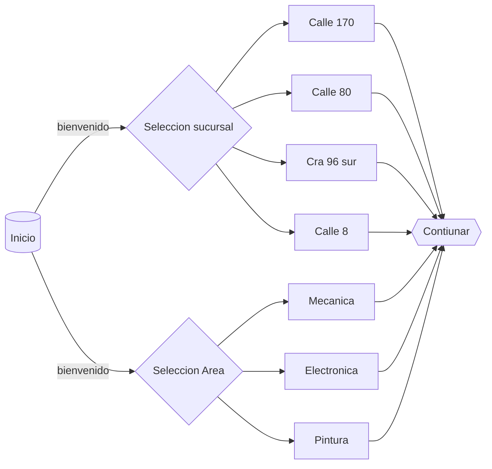
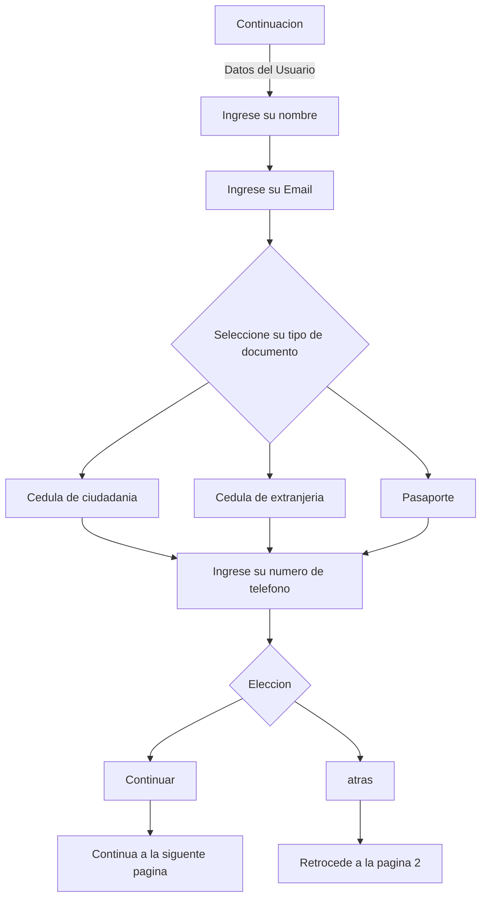
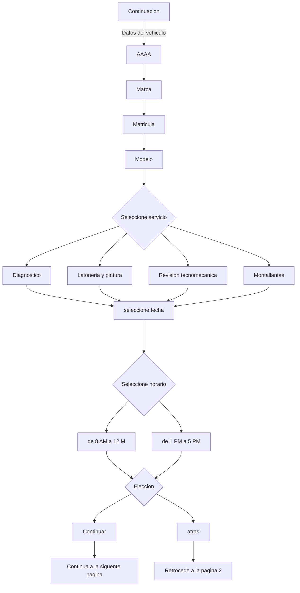
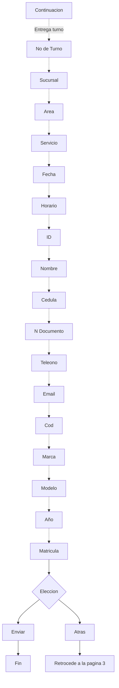

## Diagramas de casos

- Usuario
  - Pagina1

```mermaid
graph LR

a[(Inicio)]-->|bienvenido|b{Seleccion sucursal}
b-->b1[Calle 170]
b-->b2[Calle 80]
b-->b3[Cra 96 sur]
b-->b4[Calle 8]

a[(Inicio)]-->|bienvenido|c{Seleccion Area}
c-->c1[Mecanica]
c-->c2[Electronica]
c-->c3[Pintura]

b1-->d{{Contiunar}}
b2-->d
b3-->d
b4-->d
c1-->d
c2-->d
c3-->d
```

- Pagina 2

```mermaid
graph TD
d[Continuacion]-->|Datos del Usuario|e[Ingrese su nombre]-->f[Ingrese su Email]-->g{Seleccione su tipo de documento}

g-->g1[Cedula de ciudadania]
g-->g2[Cedula de extranjeria]
g-->g3[Pasaporte]

g1-->h[Ingrese su numero de telefono]
g2-->h
g3-->h

h-->i{Eleccion}
i-->i1[Continuar]-->b[Continua a la siguente pagina]
i-->i2[atras]
i2-->a[Retrocede a la pagina 2]
```

- Pagina 3

```mermaid
graph TD
i1[Continuacion]-->|Datos del vehiculo|j[AAAA]
j-->k[Marca]-->l[Matricula]-->m[Modelo]
m-->n{Seleccione servicio}
n-->n1[Diagnostico]
n-->n2[Latoneria y pintura]
n-->n3[Montallantas]
n-->n4[Revision tecnomecanica]

n1-->o[seleccione fecha]
n2-->o
n4-->o
n3-->o
o-->p{Seleccione horario}
p-->p1[de 8 AM a 12 M]
p-->p2[de 1 PM a 5 PM]

p1-->q{Eleccion}
p2-->q

q-->q1[Continuar]-->b[Continua a la siguente pagina]
q-->q2[atras]
q2-->i[Retrocede a la pagina 2]
```

- Pagina 4

```mermaid
graph TD
q1[Continuacion]-.->|Entrega turno|R[No de Turno]
R-.->R1[Sucursal]-.->R2[Area]-.->R3[Servicio]
R3-.->R4[Fecha]-.->R5[Horario]-.->R6[ID]
-.->R7[Nombre]-.->R8[Cedula]-.->R9[N Documento]
-.->R10[Teleono]-.->R11[Email]-.->R12[Cod]
-.->R13[Marca]-.->R14[Modelo]-.->R15[Año]
-.->R16[Matricula]

R16-->S{Eleccion}
S-->S1[Enviar]
S-->S2[Atras]

S2-->j[Retrocede a la pagina 3 ]
S1-->Fin
```
