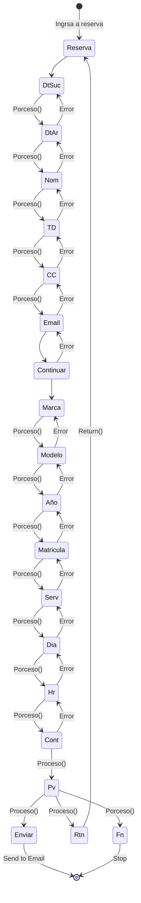

## Diagrama de estados 

```mermaid

stateDiagram-V2

    [*] --> Reserva: Ingrsa a reserva 
    Reserva --> DtSuc
    DtSuc --> DtAr : Porceso()
    DtAr --> DtSuc: Error
    DtAr --> Nom: Porceso()
    Nom --> DtAr: Error
    Nom --> TD: Porceso()
    TD --> Nom: Error
    TD --> CC: Porceso()
    CC --> TD: Error
    CC --> Email:Porceso()
    Email --> CC: Error
    Email --> Continuar 
    Continuar --> Email: Error

    Continuar --> Marca
    Marca --> Modelo: Porceso()
    Modelo --> Marca: Error
    Modelo --> Año: Porceso()
    Año --> Modelo: Error
    Año --> Matricula: Porceso()
    Matricula --> Año: Error
    Matricula --> Serv: Porceso()
    Serv --> Matricula: Error
    Serv --> Dia:Porceso()
    Dia --> Serv:Error
    Dia --> Hr:Porceso()
    Hr --> Dia: Error
    Hr --> Cont:Porceso()
    Cont --> Hr: Error
    Cont --> Pv: Proceso()

    Pv --> Fn:Porceso()
    Pv --> Rtn:Proceso()
    Pv --> Enviar: Proceso()

    Rtn --> Reserva: Return()
    Enviar --> [*]: Send to Email
    Fn --> [*]: Stop
```
